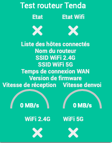

Presentation
============

This plugin is used to manage Tenda AC routers.

It allows you to restart the router and save its configuration.

Installation/Parameter
========================

We will now configure a device. To do so, click on *''Plugins / Communication / Tenda AC''*

Then click on the button at the top left *''Add equipment''*

Then enter the name of the equipment (eg Tenda AC1200)

Then define:

- *''Parent object''*

- *''Category''* (optional)

- *''Activate''* (check, otherwise the equipment will not be usable)

- *''Visible''* (optional if you don't want to make it visible on the Dashboard)

- *''IP adress''*

- *''Password''* (optional if your router does not have one)

- *''Refreshment''* (by default: 1 hour)

Dashboard
===

### FAQ
===

### How often is the data updated?
-------------------------------------------------- -----
Data is refreshed every hour by default.
Select the refresh rate of the information via the Equipment page.

### This plugin does not generate a log, how can I get one?
--------------------------------------------------
It is necessary to temporarily activate the Jeedom debug (Configuration menu ⇒ Configuration of logs & messages ⇒ Activate + Log level = Debug).

### I would like to report errors / modifications directly in the code?
-------------------------------------------------- ---------------------
It is entirely possible via
[Github](https://github.com/Flobul/Jeedom-TendaAC/)

### List of versions

*[See list of versions](changelog.md) *
