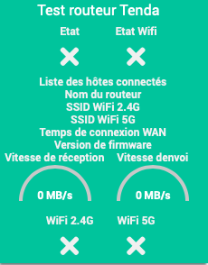

Presentación
============

Este complemento se utiliza para administrar los enrutadores de CA Tenda.

Le permite reiniciar el enrutador y guardar su configuración.

Instalación / Parámetro
========================

Ahora configuraremos un dispositivo. Para hacerlo, haga clic en *'' Complementos / Comunicación / Tenda AC ''*

Luego haga clic en el botón en la parte superior izquierda *'' Agregar equipo ''*

Luego ingrese el nombre del equipo (por ejemplo, Tenda AC1200)

Luego defina:

- *'' Objeto principal ''*

- *'' Categoría ''* (opcional)

- *'' Activar ''* (marcar, de lo contrario el equipo no será utilizable)

- *'' Visible ''* (opcional si no desea que sea visible en el Tablero)

- *''Dirección IP''*

- *'' Contraseña ''* (opcional si su enrutador no tiene una)

- *'' Refresco ''* (por defecto: 1 hora)

Tablero
===

### PREGUNTAS MÁS FRECUENTES
===

### ¿Con qué frecuencia se actualizan los datos?
-------------------------------------------------- -----
Los datos se actualizan cada hora de forma predeterminada.
Seleccione la frecuencia de actualización de la información a través de la página Equipo.

### Este complemento no genera un registro, ¿cómo puedo obtener uno?
--------------------------------------------------
Es necesario activar temporalmente la depuración de Jeedom (Menú de configuración ⇒ Configuración de registros y mensajes ⇒ Activar + Nivel de registro = Depurar).

### ¿Me gustaría informar errores / modificaciones directamente en el código?
-------------------------------------------------- ---------------------
Es completamente posible a través de
[Github](https://github.com/Flobul/Jeedom-TendaAC/)

### Lista de versiones

*[Ver lista de versiones](changelog.md) *
