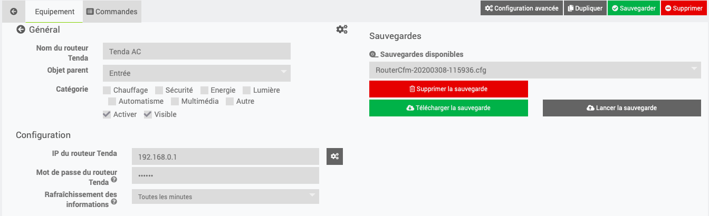

Présentation
============

Ce plugin permet de gérer les routeurs Tenda AC.

Il permet de redémarrer le routeur et de sauvegarder sa configuration.

Installation/Paramétrage
========================

Nous allons maintenant paramétrer un équipement. Pour se faire, cliquez sur *Plugins / Communication / Tenda AC*

Puis cliquez sur le bouton en haut à gauche *Ajouter un équipement*

Puis saisir le nom de l'équipement (ex. Tenda AC1200)

Puis définir :

-   *Objet parent*

-   *Catégorie* (optionnel)

-   *Activer* (à cocher, sinon l’équipement ne sera pas utilisable)

-   *Visible* (optionel si vous ne désirez pas le rendre visible sur le Dashboard)

-   *Adresse IP*

-   *Mot de passe* (optionnel si votre routeur n'en a pas)

-   *Rafraîchissement* (par défaut sur 1 heure)

Page de configuration
=========

Une fois que vous avez entré les informations de votre routeur et que celui-ci est présent, vous pouvez effectuer la sauvegarde du fichier de configuration depuis cette page.

Dashboard
=========

Routeur HS:

Routeur présent :

Page Santé
==========

FAQ
===

A quelle fréquence les données sont-elles mises à jour ?
-------------------------------------------------------

Les données sont rafraichies toutes les heures par défaut.
Selectionnez la fréquence de rafraîchissement des informations via la page Équipement.

Ce plugin ne génère pas de log, comment en avoir ?
--------------------------------------------------
Il est nécessaire au préalable d’activer temporairement le debug de Jeedom (menu Configuration ⇒ Configuration des logs & messages ⇒ Activer + Niveau de log = Debug).

Changelog
=========

*[Voir la liste des versions](changelog.md)*
